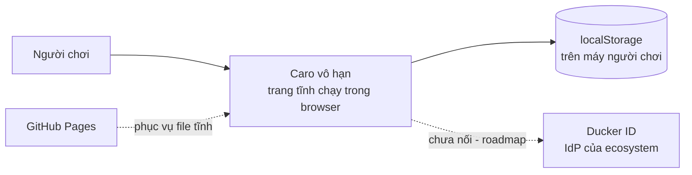
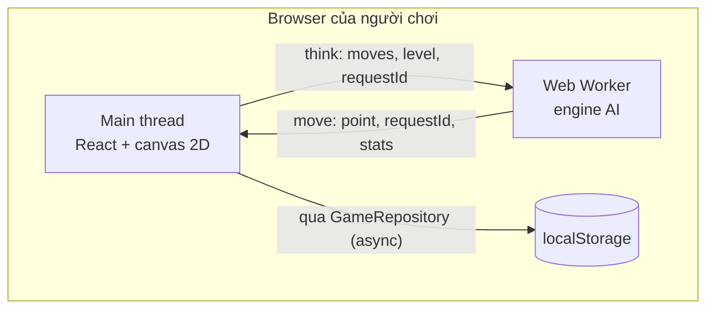

# Kiến trúc

> **Trả lời:** Hệ thống ghép lại thế nào, ranh giới giữa các phần ở đâu?
> **Trạng thái:** 🟢 đủ
> **Cập nhật:** 2026-09-03 · commit —
> **Cập nhật khi:** thêm/bỏ một module hoặc service · đổi cách hai module nói chuyện

<!-- CÁCH ĐIỀN
Mức độ: C4 mức 1 (context) và mức 2 (container). KHÔNG đi xuống class hay function —
đó là code, và code là bản mô tả chính xác nhất của chính nó.

Mục 3 (ranh giới module) là mục AI dùng nhiều nhất: nó quyết định code mới nên đặt
ở đâu. Viết mỗi module một dòng: tên · trách nhiệm một câu · được phép gọi ai.

Mục 5 chỉ ghi TÊN công nghệ + số ADR. LÝ DO chọn nằm trong ADR, không nằm đây —
nếu lý do bị chép vào đây thì hai bản sẽ lệch.

KHÔNG chứa: lý do chọn công nghệ (-> decisions/), bất biến (-> invariants.md),
schema chi tiết (-> file schema của ORM), danh sách chức năng (-> 02-requirements/scope.md).
-->

## 1. Context — hệ thống nằm giữa ai với ai

Không có hệ thống ngoài nào khác, và đó là một tính chất chứ không phải một thiếu sót:
trần chi phí hạ tầng 0đ (xem `01-product/overview.md` §5) loại bỏ mọi backend. Mũi tên
tới Ducker ID vẽ nét đứt vì nó **chưa tồn tại trong code** — Ducker ID chưa có endpoint
OAuth nào (ADR-0006).

## 2. Container — hệ thống gồm những khối chạy được nào

Chỉ có hai khối chạy được: main thread và một Web Worker. Worker **vô trạng thái** — mỗi
lần nghĩ nó nhận cả danh sách nước đi và dựng lại bàn, nên nó không thể lệch với UI
(ADR-0004).

## 3. Module và ranh giới

| Module | Trách nhiệm một câu | Được phép gọi | **Không** được gọi |
| --- | --- | --- | --- |
| `game/core` | Luật chơi và máy trạng thái ván: bàn thưa, đoạn cực đại, phát hiện thắng, apply/undo | không gì (thuần TS) | `render` · `ai` · `storage` · React · DOM |
| `game/ai` | Lượng giá thế bàn và tìm nước đi; entry của Worker | `game/core` | `render` · `storage` · React · DOM |
| `game/render` | Vẽ một khung lên canvas và đổi toạ độ bàn ↔ màn hình | `game/core` · `render/palette` | `ai` · `storage` · React |
| `game/storage` | Bọc `localStorage` và định nghĩa ranh giới repository | `game/core` (chỉ kiểu dữ liệu) | `render` · `ai` · React |
| `hooks` | Cầu nối React ↔ game: giữ state, nói chuyện với Worker, gọi repository | tất cả module `game/*` | — |
| `views` | Bố cục và các lớp phủ | `hooks` · `render` · `lib/strings` | `game/core` · `ai` · `storage` trực tiếp |
| `lib/strings` | Toàn bộ chuỗi hiển thị, tiếng Việt | không gì | — |

Ranh giới này là thứ cho phép kiểm toàn bộ luật và toàn bộ AI bằng unit test trên thế bàn
dựng tay, không cần browser. Nó cũng là bất biến — xem `invariants.md` dòng 4 và 5.

## 4. Luồng dữ liệu của đường đi quan trọng nhất

**Người chơi đánh một nước rồi máy đáp lại** — mọi thứ khác trong game đi theo luồng này.

1. `views` nhận sự kiện con trỏ, đưa toạ độ màn hình cho `render/camera` đổi thành toạ độ
   bàn, lấy giao điểm gần nhất trong bán kính hit-test.
2. Trên cảm ứng, lần tap đầu chỉ đặt quân xem trước; phải xác nhận mới sang bước 3. Trên
   chuột thì đi thẳng sang bước 3 (ADR-0007).
3. `hooks` gọi `core/game.applyMove`. `core` kiểm nước hợp lệ, thêm vào `moves`, cập nhật
   bàn dẫn xuất, rồi chạy `core/rules` **chỉ quanh nước vừa đánh** để xem có thắng.
4. Nếu thắng: `hooks` gọi `storage` ghi kết quả vào thống kê, `render` tô chuỗi thắng, và
   camera trượt để chuỗi thắng không bị lớp phủ che. Luồng dừng ở đây.
5. Nếu chưa thắng: `hooks` gửi `{ moves, level, requestId }` sang Worker và bật trạng thái
   "máy đang nghĩ" **có hạn thời gian**.
6. Worker dựng lại bàn từ `moves`, thử hai bước rẻ (thắng ngay / chặn ngay), rồi search
   trong ngân sách của mức, trả về `{ point, requestId, stats }`.
7. `hooks` **bỏ** kết quả nếu `requestId` không còn khớp (người chơi đã hoàn nước trong
   lúc chờ). Nếu khớp thì apply nước của máy qua đúng bước 3.
8. Sau mỗi nước, `hooks` ghi ván đang chơi qua `GameRepository` để US-02 chạy được.

## 5. Tech stack

| Lớp | Công nghệ | Biện minh |
| --- | --- | --- |
| Framework | Next.js 15 App Router, `output: 'export'` | ADR-0001 |
| UI | React 19, TypeScript strict | ADR-0001 |
| Vẽ bàn | Canvas 2D, vẽ bằng code, không file ảnh | ADR-0001 |
| Style | Tailwind CSS v3, lucide-react | ADR-0001 |
| Trạng thái ván | Map thưa + danh sách nước đi | ADR-0002 |
| Luật thắng | Đoạn cực đại, chặn hai đầu | ADR-0003 |
| AI | Minimax + alpha-beta trong Web Worker | ADR-0004 · ADR-0005 |
| Lưu trữ | `localStorage` sau ranh giới repository async | ADR-0006 |
| Âm thanh | WebAudio oscillator, không file | ADR-0001 |
| Test | vitest (unit) · Playwright (E2E) | — |
| Hosting | GitHub Pages, tĩnh | ADR-0001 |
